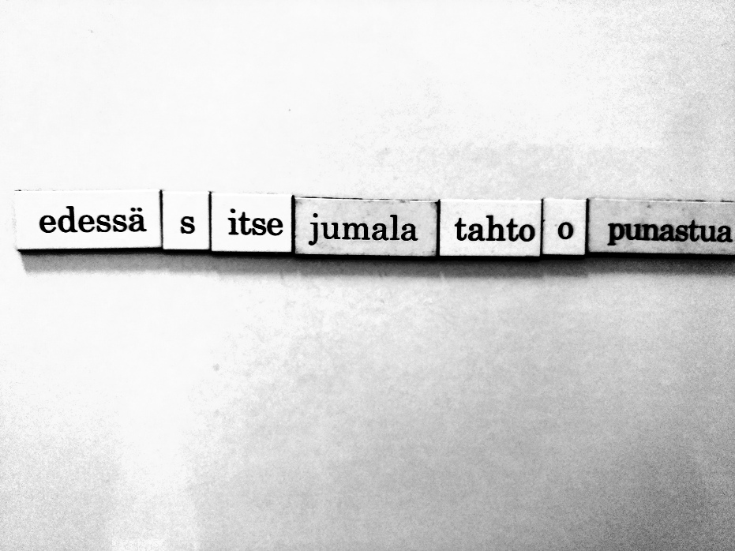
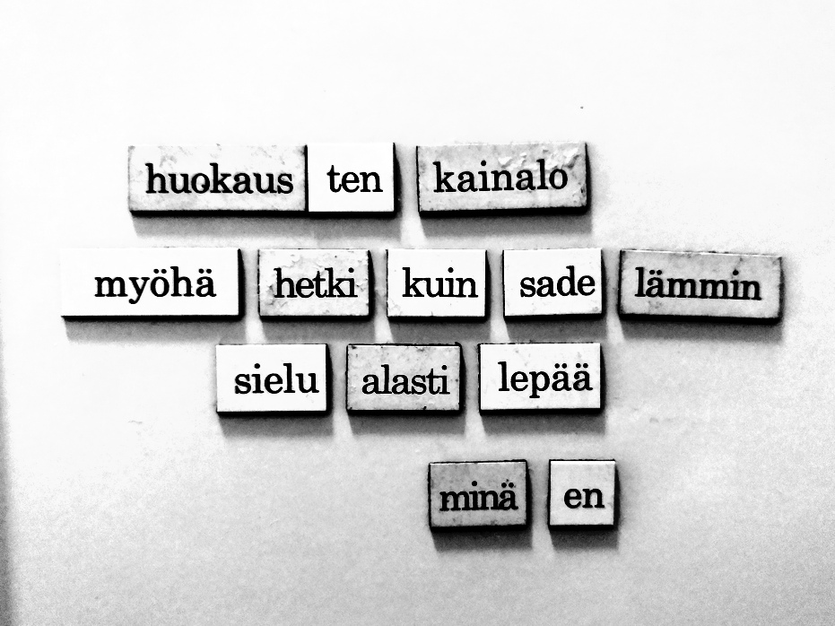
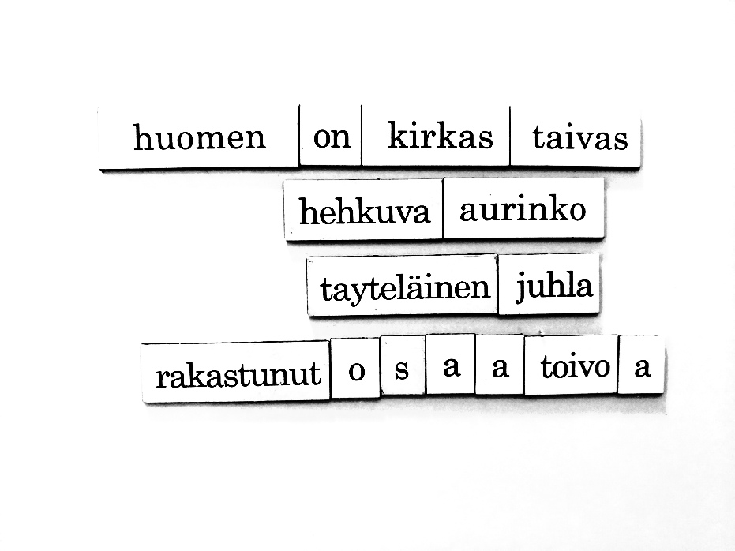
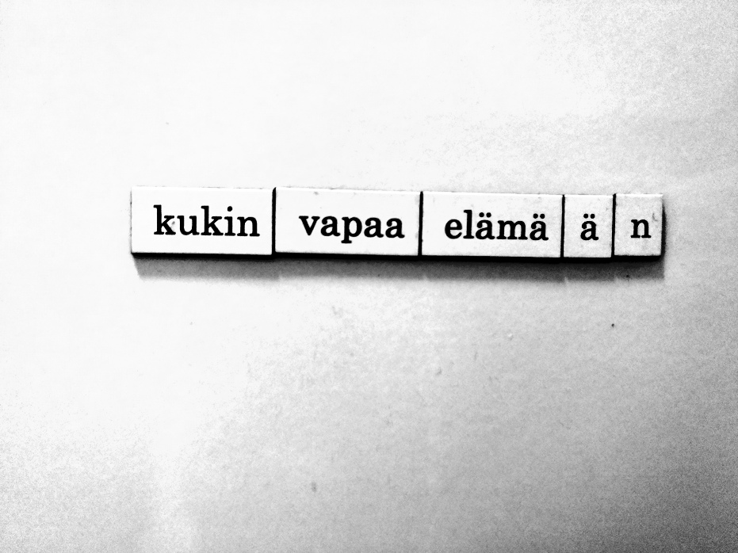
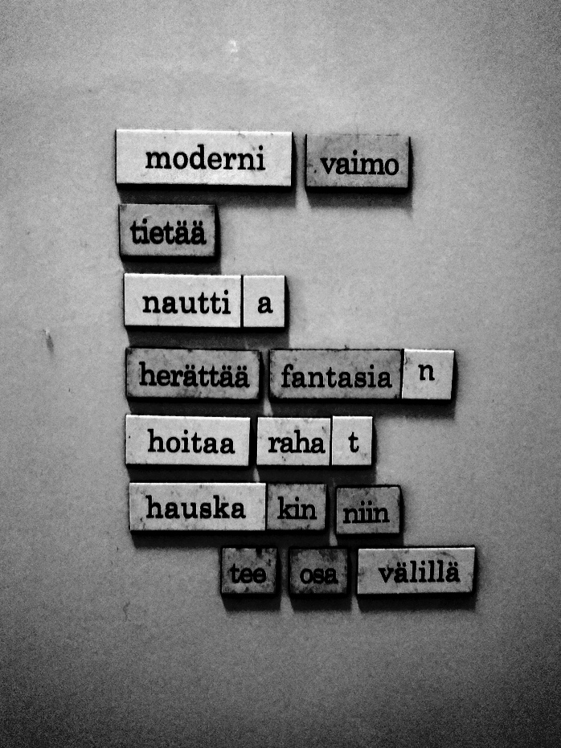
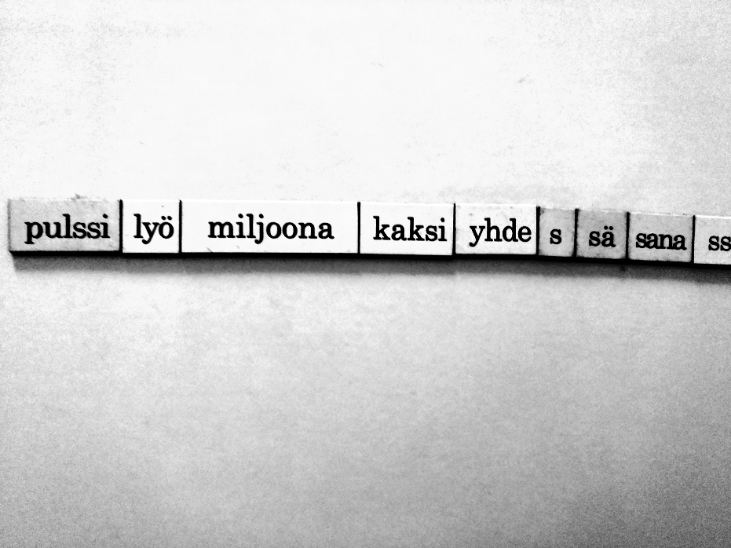

```{r setup, include=FALSE}
knitr::opts_chunk$set(echo = TRUE)
```

## huussirunot

Minulla on jääkaappimagneetteja huoneessa, jossa ennemmin tai myöhemmin jokainen vieras käy. Tämä sivu on koosta kaikista niistä runoista joita minä ja vieraani ovat jättäneet lavuaarini metalliselle pinnalle.Toistaiseksi ne eivät ole missään järjestyksessä, ajallisesti tai muutoin. Ehkä joku päivä luokittelen ne, tai sitten en.

## 2021


{width=30%} {width=30%} {width=30%}

{width=30%} {width=30%} {width=30%}
{width=30%} {width=30%} {width=30%}
{width=30%} {width=30%} {width=30%} {width=30%} {width=30%} {width=30%} {width=30%}  {width=30%} {width=30%} {width=30%} {width=30%} {width=30%}